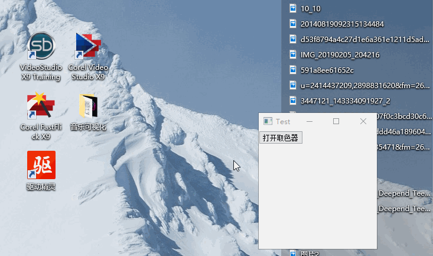

# Qt屏幕取色器

- 地址：https://github.com/Italink/ColorPicker.git



## 程序细节

自动调节放大镜显示位置

自动切换边框颜色

## 原理

- 首先给整个屏幕覆盖上一层高透明度的无边框窗口(这里我用的颜色为（255，255，255），且透明度为1 (【0,255】）)

- 通过定时器或线程实时更新鼠标位置，注意不要使用鼠标移动事件，如果通过鼠标移动来触发取色无法对动态视频取色
- 通过截图函数，对整个窗口进行截图，其中选择以鼠标为中心的一块矩形，我选取的大小是10*7，而放大镜是100*70，故放大倍数为10，将这部分矩形图形放在放大镜中，且选取鼠标所在位置的像素颜色。
- 选取的像素颜色因为有透明窗口的原因会有偏差，需要根据透明度算法恢复原来的颜色
- 透明原理：假设B为透明色,透明度为a，A为底部颜色，C为最终显示颜色，255*C=a*B+(255-a)*A
- 复原只需要根据公式求A即可
- 当鼠标点击时，关闭透明窗口，发送颜色信号即可

## 使用说明

只需导入类文件，在所需窗口创建ColorPicker实例即可，由于继承自QWidget，调用show函数进行显示

 通过connect信号量 void QColorPicker::colorSelect(const QColor&)  可以获取选取的颜色

 注意导入连接图标文件，否则可能无法精准取色

## 配置说明

位于mousedropper.cpp中

``` c++
const QSize winSize(100,100);       //窗口尺寸
const int grabInterval=50;          //刷新频率
const int magnificationTimes=10;    //放大倍数
const double split=0.7;             //分割
const int sizeOfMouseIcon=20;       //鼠标图标大小图标素材：
```
