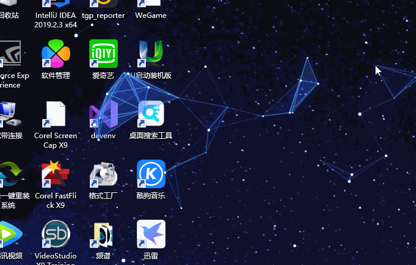
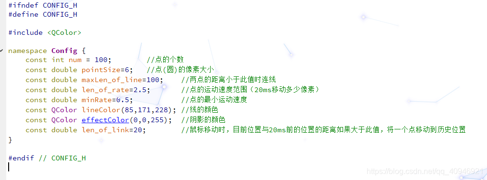

# Qt桌面粒子特效

- Github仓库：https://github.com/Italink/DesktopParticlesEffect

最近看哪吒发现里面有个很炫酷的粒子效果：


突发奇想想自己实现一下，这是最终的效果：



## 使用工具

至少掌握一种GUI工具：这里我用的是Qt5+QtCreator

## 需要掌握

- 绘图机制
- 多线程（实时更新画面）
-  windows窗口属性修改（窗口透明，隐藏边框，鼠标穿透）

## 动画机制

- 点：动画中有很多飘散的点（实际是一个很小的圆），这些点按不同的速度，不同的方向在运动，为了防止点跑出屏幕外，我们需要增加一个碰撞机制，当点碰到屏幕的时候，需要改变点的运动方向（遵循光的反射机制），并且我这里在碰撞的时候随机给点一个速度。

- 线： 通过检测上面的点集合，当两个点距离达到某一范围时，画线，且线的透明的与线的长度相关联。

- 三角形：当画完一条线之后，遍历点集，查看这个点是否可以构成三角形，如果可以，则进行绘制，并且关联透明度
- 鼠标移动：设置一个点，跟踪鼠标位置，这样鼠标的位置也可以画线和画三角形。记录鼠标的历史轨迹，当鼠标的移动速度到达某个值时，随机将点集中的一个点放到历史轨迹上。

## 配置



## 绘制代码

``` c++
void Widget::paintEvent(QPaintEvent *e)
{
    QPainter painter(this);
    painter.setRenderHint(QPainter::Antialiasing,true);
    QPen pen;
    pen.setWidthF(1.2);
    painter.setPen(pen);
    QColor c(Config::lineColor);
    c.lighter();
    QPolygon p;
    for(unsigned int i=0;i<points.size();++i){      //注意去重
        for(unsigned int j=i+1;j<points.size();++j){
            if(points[i].getDistance(points[j])<Config::maxLen_of_line){
                c.setAlpha(Config::maxLen_of_line-points[i].getDistance(points[j]));
                pen.setBrush(c);
                painter.setPen(pen);
                painter.drawLine(points[i].getX(),points[i].getY(),points[j].getX(),points[j].getY());      //画线
                c.setAlpha((Config::maxLen_of_line-points[i].getDistance(points[j]))/3);
                painter.setBrush(c);
                for(int k=j+1;k<points.size();++k){
                    if(points[k].getDistance(points[i])<Config::maxLen_of_line&&points[k].getDistance(points[j])<Config::maxLen_of_line){
                        p.setPoints(3,int(points[i].getX()),int(points[i].getY()),int(points[j].getX()),int(points[j].getY()),int(points[k].getX()),int(points[k].getY()));
                        painter.drawPolygon(p);                                 //画三角形
                    }
                }
            }
 
        }
        painter.setBrush(QColor(252,251,243));
        painter.setPen(Qt::NoPen);
        if(i)           //画点，第一个点用作鼠标
            painter.drawEllipse(points[i].getRect());
    }
}
```

## 点运行代码

``` c++
void Widget::run()
{
    collisionDetection();
 
    points[0].setX(QCursor::pos().x());
    points[0].setY(QCursor::pos().y());
    for(int i=1;i<points.size();++i)
    {
        points[i].run();
    }
    int x=(lastPos-QCursor::pos()).x(),
        y=(lastPos-QCursor::pos()).y();
    if(sqrt(x*x+y*y)>Config::len_of_link)
    {
        int index=1+qrand()%(points.size()-1);
        points[index].setX(lastPos.x());
        points[index].setY(lastPos.y());
    }
    lastPos=QCursor::pos();
    update();
}
```

